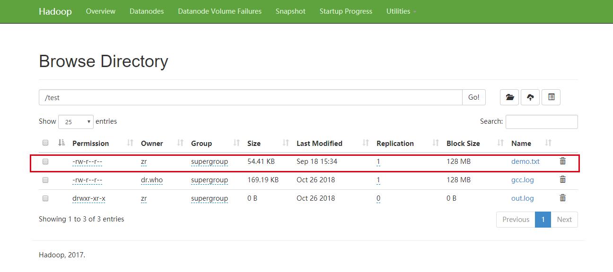

### 
hdfs之java接口

---

#### 一、从Hadoop的url读取数据

- 代码

      /**
       * @Author super rui
       * @Date 2019/08/31
       */
      public class URLCat {
          static {
              URL.setURLStreamHandlerFactory(new FsUrlStreamHandlerFactory());
          }
          public static void main(String[] args) {
              readFile();
          }
          /**
           * 从hadoop的url读取数据
           */
          private static void readFile() {
              InputStream in = null;
              try {
                  in = new URL(PATH).openStream();
                  IOUtils.copyBytes(in,System.out,4096,false);
              } catch (IOException e) {
                  e.printStackTrace();
              }finally {
                  IOUtils.closeStream(in);
              }
          }
      
      } 
     
     
- 运行结果

      I	1
      LW	1
      am	1
      hadoop	1
      hello	1
      to	1
      welcome	1
      world	1
      
- 方法总结

&ensp;&ensp;&ensp; 这种方式采用java.net.URL对象调用setURLStreamHandlerFactory()方法，将FsUrlStreamHandlerFactory对象作为输入参数，
但是每个java虚拟机只能调用一次这个方法，常在静态方法中调用。

      
#### 二、通过FileSystem API读取数据

- 代码
  
        /**
         * @Author super rui
         * @Date 2019/08/31
         */
        public class FileSyetemCat {
            public static void main(String[] args) throws IOException {
                fileRead();
            }
            private static void fileRead() throws IOException {
                Configuration configuration = new Configuration();
                FileSystem fs = FileSystem.get(URI.create(PATH), configuration);
                InputStream in = null;
                try {
                    in = fs.open(new Path(PATH));
                    IOUtils.copyBytes(in, System.out, 4096, false);
                } finally {
                    IOUtils.closeStream(in);
                }
        
        
            }
        } 

- 运行结果
    
      I	1
      LW	1
      am	1
      hadoop	1
      hello	1
      to	1
      welcome	1
      world	1
      
- 方法总结

   FileSystem 是通用的文件系统API，所以第一步要实现文件系统的实例，FilaSystem实例有以下三个静态方法
      
      public static FileSystem get(Configuration conf)
      public static FileSystem get(URI uri, Configuration conf)
      public static FileSystem get(final URI uri, final Configuration conf, String user)
      
  Configuration对象封装了客户端或者服务端的各种配置，第一个方法返回默认的文件系统，第二个方法通过给定的url和权限来确定使用的
  文件系统，作为客户端访问的文件系统，对于安全来说至关重要。
      
      
    
   

    

#### 三、数据写入

&ensp;&ensp;&ensp; FileSystem类有一系列新建文件的方法。最简单的方式是给准备新建的文件指定一个Path对象。
然后返回一个用于写入的输出流。此方法有很多重载版本，允许我们是否需要强制覆盖现有文件、
文件备份数目、写入文件时所用的缓冲区大小，文件快大小以及文件权限。

- 代码

        package com.zr.hadoop;

        import org.apache.hadoop.conf.Configuration;
        import org.apache.hadoop.fs.FileSystem;
        import org.apache.hadoop.fs.Path;
        import org.apache.hadoop.util.Progressable;
        import java.io.*;
        import java.net.URI;
        public class FileCopyWithProgress {
            public static void main(String[] args) throws IOException {
                String localSrc = args[0];
                String dst = args[1];
                InputStream in = new BufferedInputStream(new FileInputStream(localSrc));
                Configuration configuration = new Configuration();
                FileSystem fs = FileSystem.get(URI.create(dst), configuration);
                OutputStream out = fs.create(new Path(dst), new Progressable() {
                    @Override
                    public void progress() {
                        System.out.println(".");
                        System.out.println("----------");
                    }
                });
        
                org.apache.hadoop.io.IOUtils.copyBytes(in, out, 4409, true);
        
        
            }
        }
        
- maven编译jar包
        
       mvn clean install -DskipTests
                
- hadoop执行jar包

        hadoop jar hadoop-java-example-1.0-SNAPSHOT.jar  com.zr.hadoop.FileCopyWithProgress D:\test\lw-technique-sharing\hadoop-java-example\target\demo.txt  /test/demo.txt

- 指令解释
     
    
- 访问hdfs文件系统查看文件是否上传成功
   
   
#### 五、目录
&ensp;&ensp;&ensp;  FileSystem实例提供了创建目录的方法

    public boolean mkdirs(Path f) throws IOException

&ensp;&ensp;&ensp; 此方法一次性创建所有必要的文件夹，就像 java.io.File 类的 mkdirs() 方法，如果所有目录都创建成功就会返回true。

#### 六、查询文件系统

&ensp;&ensp;&ensp; FileSystem 类提供的 getFileStatus() 方法用于获取文件的 FileStatus对象，FileStatus 对象包含了文件的长度、块大小、复本、修改时间、所有者以及权限等。
如果需要查看目录中的内容，调用FileSystem提供的 listStatus() 方法即可。

#### 七、删除数据

&ensp;&ensp;&ensp; 使用FileSystem的 delete()可以永久性的删除文件或者目录

    public boolean delete(Path f, boolean recursive) throws IOException
    
&ensp;&ensp;&ensp; 如果 f 是一个文件或者空目录，recursive 的值就会被忽略。只有当recursive的值为true时,非空目录及其内容会被删除，否则抛出异常。