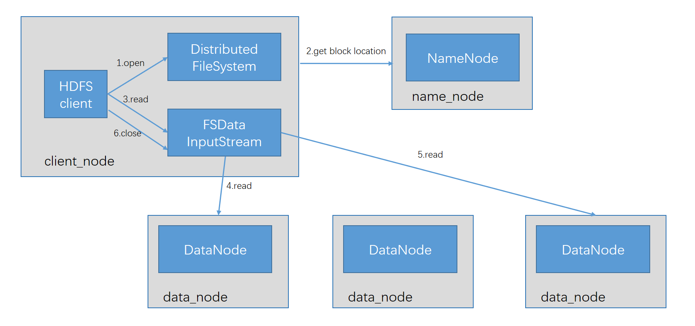

### 
hdfs之数据流

---

#### 一、剖析文件读取

#### 二、剖析文件写入

#### 三、一致模型
&ensp;&ensp;&ensp; 文件一致性模型(coherency model)描述了文件读/写的数据可见性，当写入数据超过一个块之后，第一个块对新的reader既是可见的，
FileSystem提供了一个方法来使所有缓存和数据节点强行同步，即用FSDataOutputStream调用sync() 方法。当sync() 返回成功后，对所有新的reader来说，HDFS能够保证到目前为止写入的数据均到达所有dataNode的写入管道并且对所有reader可见。
#### 四、通过 Flume 和 Sqoop 导入数据
&ensp;&ensp;&ensp; Flume是在每个数据源上运行一个flume节点，通过多个层级的聚合节点，最后将数据导入HDFS；
&ensp;&ensp;&ensp; Sqoop是将结构数据批量导入HDFS中

#### 五、通过 distcp 并行复制
&ensp;&ensp;&ensp; distcp实现了分布式的复制功能，可以从hadoop系统之间复制大量数据，也可以将大量数据复制到hadoop中

    hadoop distcp hdfs://namenode1/foo hdfs://namenode2/bar 
    
&ensp;&ensp;&ensp;上面指令表示把第一个集群 /foo目录（及其内容） 复制到第二个集群的bar目录下 

#### 五、hadoop存档
&ensp;&ensp;&ensp; 每个文件都按照快方式存储，每个块的元数据都存储在nameNode的内存中，因此hadoop存储小文件非常低效。因为大量的小文件会耗尽nameNode中的内存。

- 使用hadoop的存档工具

&ensp;&ensp;&ensp;
    hadoop存档是通过archive工具根据一组文件创建而来的。该工具通过运行一个mapreduce作业来并行处理所有输入文件。
    Hadoop Archives (HAR files)是在 Hadoop 0.18.0 版本中引入的，它的出现就是为了缓解大量小文件消耗 NameNode 内存的问题。HAR 文件是通过在 HDFS 上构建一个层次化的文件系统来工作。一个 HAR 文件是通过 hadoop 的 archive 命令来创建，而这个命令实 际上也是运行了一个 MapReduce 任务来将小文件打包成 HAR 文件。对客户端来说，使用 HAR 文件没有任何影响。所有的原始文件都可见并且可访问的（通过 har://URL）。但在 HDFS 端它内部的文件数减少了。
  