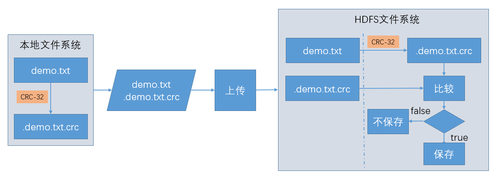

## 
Hadoop的I/O操作

### 1、数据完整性

####1.1、数据完整性概述

&emsp;&emsp; 检测数据是否损坏的常用措施是：在数据第一次引入系统时计算校验和并在数据通过一个不可靠的同道进行传输时再一次计算校验和，这样就能发现数据是否损坏。如果计算所得的新校验和原来的校验不匹配，那么表明数据已经损坏。

- 注意：该技术并不能修复数据，它只能检测出数据错误。（校验和数据也可能损坏，但是由于校验和文件小，所以损坏的可能性小）
- 常用的错误检测码是：CRC-32（循环冗余校验），使用CRC-32算法任何大小的数据输入均计算得到一个32位的整数校验码。

####1.2、HDFS的数据完整性

#####1.2.1、文件上传到HDFS过程中的校验

- 上传过程流程图

- 校验过程

&emsp;&emsp; dataNode负责收到数据后储存该数据及其验证校验和。

#####1.2.2、文件读取到本地过程中的校验

&emsp;&emsp; 文件读取到本地的验证和文件上传验证是相反的，客户端如果通过.crc文件对比，如果不同则告诉nameNode文件有损坏，nameNode会从其他replica节点进行修复。

#####1.2.3、实时校验

&emsp;&emsp; 每个dataNode会在后台线程中运行一个DataBlockScanner，从而定期验证存储存储在这个dataNode上的所有数据块，来确保存储的数据不是损坏的。

#####1.2.4、代码实现实现

&emsp;&emsp; Hadoop的LocalFileSystem执行客户端的校验和验证。当在你写入一个filename的文件时，文件系统客户端会明确地在包含每一个文件校验和的同一个目录内新建一个名为.filename.crc的隐藏文件。

注意：当你把文件上传到HDFS集群中时，你要对文件在本地进行CRC校验就使用LocalFileSystem。你不想对文件进行校验时就是用RawFileSystem。

- 上传
 
        import java.io.OutputStream;
    	import java.net.URI;
    	import org.apache.hadoop.conf.Configuration;
    	import org.apache.hadoop.conf.Configured;
    	import org.apache.hadoop.fs.FSDataOutputStream;
    	import org.apache.hadoop.fs.FileSystem;
    	import org.apache.hadoop.fs.LocalFileSystem;
    	import org.apache.hadoop.fs.Path;
    	import org.apache.hadoop.fs.RawLocalFileSystem;
    	import org.apache.hadoop.util.Tool;
    	import org.apache.hadoop.util.ToolRunner;
    	
    	public class DataIntegrity_Put_0010 extends Configured implements Tool{
	    
		    private FileSystem fs;
		    private OutputStream os;
	    
		    @Override
		    public int run(String[] args) throws Exception{
			    Configuration conf=getConf();
			    //不做数据校验
			    fs=new RawLocalFileSystem();
			    //因为是直接new的对象，所以这里使用这个方法去传递配置文件
			    fs.initialize(URI.create(args[0]),conf);
			    os=fs.create(new Path(args[0]));
			    os.write("123456".getBytes());
			    os.close();
			    
			    //做数据校验
			    fs=new LocalFileSystem(fs);
			    os=fs.create(new Path(args[1]));
			    os.write("09876".getBytes());
			    os.close();
			    return 0;
		    }
		    
		    public static void main(String[] args) throws Exception{
			    System.exit(
			    ToolRunner.run(
			    new DataIntegrity_Put_0010(),
			    args));
		    }
	    }

- 读取

	    import java.io.InputStream;
		import java.net.URI;
		import org.apache.hadoop.conf.Configuration;
		import org.apache.hadoop.conf.Configured;
		import org.apache.hadoop.fs.FileSystem;
		import org.apache.hadoop.fs.LocalFileSystem;
		import org.apache.hadoop.fs.Path;
		import org.apache.hadoop.fs.RawLocalFileSystem;
		import org.apache.hadoop.util.Tool;
		import org.apache.hadoop.util.ToolRunner;
	
		public class DataIntegrity_Get_0010
		    extends Configured implements Tool{
		
		    private FileSystem fs;
		    private InputStream is;
		
		    @Override
		    public int run(String[] args) throws Exception{
		        Configuration conf=getConf();
		
		        fs=new RawLocalFileSystem();
		        fs.initialize(URI.create(args[0]),conf);
		        is=fs.open(new Path(args[0]));
		        byte[] buff=new byte[1024];
		        int len=is.read(buff);
		        System.out.println(new String(buff,0,len));
		        is.close();
		
		        fs=new LocalFileSystem(fs);
		        is=fs.open(new Path(args[1]));
		        byte[] buff1=new byte[1024];
		        int len1=is.read(buff1);
		        System.out.println(new String(buff1,0,len1));
		        is.close();
		
		        return 0;
		    }
		
		    public static void main(String[] args) throws Exception{
		        System.exit(ToolRunner.run(new DataIntegrity_Get_0010(),args));
		    }
		}

### 2、压缩

### 3、序列化
&ensp;&ensp;&ensp;

### 4、序列化框架
&ensp;&ensp;&ensp; 

### 5、Avro
&ensp;&ensp;&ensp; 

### 6、基于文件的数据结构
&ensp;&ensp;&ensp; 