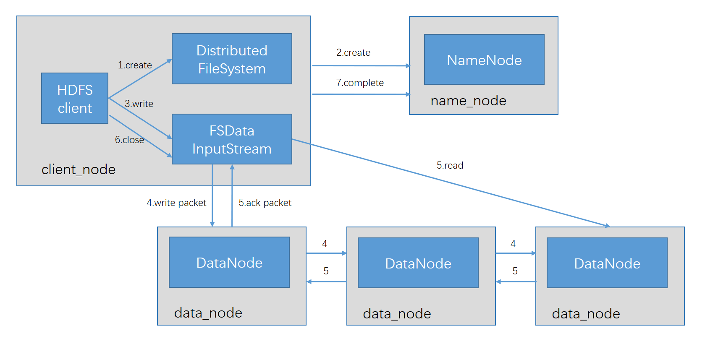

## 
Hadoop的I/O操作

### 1、数据完整性

#### 1.1、数据完整性概述

&emsp;&emsp; 检测数据是否损坏的常用措施是：在数据第一次引入系统时计算校验和并在数据通过一个不可靠的同道进行传输时再一次计算校验和，这样就能发现数据是否损坏。如果计算所得的新校验和原来的校验不匹配，那么表明数据已经损坏。

- 注意：该技术并不能修复数据，它只能检测出数据错误。（校验和数据也可能损坏，但是由于校验和文件小，所以损坏的可能性小）
- 常用的错误检测码是：CRC-32（循环冗余校验），使用CRC-32算法任何大小的数据输入均计算得到一个32位的整数校验码。

#### 1.2、HDFS的数据完整性

##### 1.2.1、文件上传到HDFS过程中的校验

- 上传过程流程图

- 校验过程

&emsp;&emsp; dataNode负责收到数据后储存该数据及其验证校验和。

##### 1.2.2、文件读取到本地过程中的校验

&emsp;&emsp; 文件读取到本地的验证和文件上传验证是相反的，客户端如果通过.crc文件对比，如果不同则告诉nameNode文件有损坏，nameNode会从其他replica节点进行修复。

##### 1.2.3、实时校验

&emsp;&emsp; 每个dataNode会在后台线程中运行一个DataBlockScanner，从而定期验证存储存储在这个dataNode上的所有数据块，来确保存储的数据不是损坏的。

#####   1.2.4、代码实现实现

&emsp;&emsp; Hadoop的LocalFileSystem执行客户端的校验和验证。当在你写入一个filename的文件时，文件系统客户端会明确地在包含每一个文件校验和的同一个目录内新建一个名为.filename.crc的隐藏文件。

注意：当你把文件上传到HDFS集群中时，你要对文件在本地进行CRC校验就使用LocalFileSystem。你不想对文件进行校验时就是用RawFileSystem。

- 上传
 
        /**
         * @Description 验证文件的完整性
         * @Author super rui
         * @Date 2019/10/08
         */
        public class CheckSumPut extends Configured implements Tool {
        
            private FileSystem fs;
            private OutputStream os;
        
            @Override
            public int run(String[] args) throws Exception {
                Configuration conf = getConf();
                //不做数据校验
                fs = new RawLocalFileSystem();
                //因为是直接new的对象，所以这里使用这个方法去传递配置文件
                fs.initialize(URI.create(args[0]), conf);
                os = fs.create(new Path(args[0]));
                os.write("123456".getBytes());
                os.close();
        
                //做数据校验
                fs = new LocalFileSystem(fs);
                os = fs.create(new Path(args[1]));
                os.write("09876".getBytes());
                os.close();
                return 0;
            }
            public static void main(String[] args) throws Exception {
                System.exit(ToolRunner.run(new CheckSumPut(), args));
            }

- 读取

        /**
         * @Description 获取文件时候验证文件的完整性
         * @Author super rui
         * @Date 2019/10/08
         */
        public class CheckSumGet extends Configured implements Tool {
            private FileSystem fs;
            private InputStream is;
            @Override
            public int run(String[] args) throws Exception {
                Configuration conf = getConf();
                fs = new RawLocalFileSystem();
                fs.initialize(URI.create(args[0]), conf);
                is = fs.open(new Path(args[0]));
                byte[] buff = new byte[1024];
                int len = is.read(buff);
                System.out.println(new String(buff, 0, len));
                is.close();
                
                fs = new LocalFileSystem(fs);
                is = fs.open(new Path(args[1]));
                byte[] buff1 = new byte[1024];
                int len1 = is.read(buff1);
                System.out.println(new String(buff1, 0, len1));
                is.close();
                return 0;
            }
        
            public static void main(String[] args) throws Exception {
                System.exit(ToolRunner.run(new CheckSumGet(), args));
            }
        }

### 2、压缩
#### 2.1 概述
&ensp;&ensp;&ensp;文件压缩有两大好处：第一、减少存储文件所需要的磁盘空间；第二、加快数据流在网络和磁盘上的传输。

&ensp;&ensp;&ensp; 

&ensp;&ensp;&ensp; 有很多种不同的压缩工具和压缩算法，他们各有千秋，但是每种压缩算法都是权衡空间/时间：压缩和解压缩速度更快，其代价通常只能节省少量的空间。

#### 2.2 codec
&ensp;&ensp;&ensp; codec实现了一种压缩-解压缩算法，其实质就是实现CompressionCodec接口。

- hadoop的压缩codec

&ensp;&ensp;&ensp; 

- hadoop压缩与解压缩原理

  

- 通过CompressionCodeFactory推断CompressionCodec
    在读取一个压缩文件的时候，通常可以根据某个文件名判断使用哪个codec，CompressionCodecFactory通过使用getCodec()方法，提供一种将
    文件扩展名映射到一个CompressCodec的对象，该方法取文件的path作为参数。
    
        /**
         * @Description 通过文件扩展名选取codec解压缩文件
         * @Author super rui
         * @Date 2019/10/11
         */
        public class FileDecompressor {
            public static void main(String[] args) throws IOException {
                String url = args[0];
                Configuration configuration = new Configuration();
                FileSystem fileSystem = FileSystem.get(URI.create(url), configuration);
                Path inputPath = new Path(url);
                CompressionCodecFactory factory = new CompressionCodecFactory(configuration);
                CompressionCodec codec = factory.getCodec(inputPath);
                if (codec == null) {
                    System.out.println("没有找到该类压缩");
                    System.exit(1);
                }
        
        
                String outputUri = factory.removeSuffix(url, codec.getDefaultExtension());
                //CompressionCodecFactory的removeSuffix（）用来返回一个文件名，如README.txt.gz调用removeSuffix（）方法后，返回的是README.txt
                //CompressionCodec的getDefaultExtension()方法返回的是一个压缩算法的压缩扩展名，如gzip的是.gz
        
                System.out.println("压缩算法的生成文件的扩展名：" + codec.getDefaultExtension());
                System.out.println("解压后生成的文件名：" + outputUri);
                InputStream in = null;
                OutputStream out = null;
                in = codec.createInputStream(fileSystem.open(inputPath));
                out = fileSystem.create(new Path(outputUri));
                IOUtils.copyBytes(in, out, configuration);
                IOUtils.closeStream(in);
                IOUtils.closeStream(out);
            }
        }

- 通过CompressionCodec对数据流进行压缩和解压缩

&ensp;&ensp;&ensp; CompressionCodec包含两个函数，可以轻松的用于压缩和解压缩数据。对输出流进行压缩用createOutputStream，读取数据流用createInputStream

将本地文件压缩上传到HDFS

    /**
     * @Description 文件的压缩
     * @Author super rui
     * @Date 2019/10/08
     */
    public class CompressorCodec extends Configured implements Tool {
        @Override
        public int run(String[] args) throws Exception {
            Configuration conf = getConf();
            String input = conf.get("input");
            String output = conf.get("output");
            LocalFileSystem lfs = FileSystem.getLocal(conf);
            FileSystem rfs = FileSystem.get(URI.create(output), conf);
            FSDataInputStream is = lfs.open(new Path(input));
            FSDataOutputStream os = rfs.create(new Path(output));
            CompressionCodecFactory ccf = new CompressionCodecFactory(conf);
            //把路径传进去，根据指定的后缀名获取编解码器
            CompressionCodec codec = ccf.getCodec(new Path(output));
            CompressionOutputStream cos = codec.createOutputStream(os);
            System.out.println(codec.getClass().getName());
            IOUtils.copyBytes(is, cos, 1024, true);
            //close
            return 0;
        }
    
        public static void main(String[] args) throws Exception {
            System.exit(ToolRunner.run(new CompressorCodec(), args));
        }
    }

将FHDFS中的文件解压缩到本地

    /**
     * @Description 文件的解压
     * @Author super rui
     * @Date 2019/10/08
     */
    public class DecompressorCodec extends Configured implements Tool {
        @Override
        public int run(String[] args) throws Exception {
            Configuration conf = getConf();
            String input = conf.get("input");
            String output = conf.get("output");
            FileSystem rfs = FileSystem.get(URI.create(input), conf);
            LocalFileSystem lfs = FileSystem.getLocal(conf);
    
            FSDataInputStream is = rfs.open(new Path(input));
            FSDataOutputStream os = lfs.create(new Path(output));
    
            CompressionCodecFactory factory = new CompressionCodecFactory(conf);
            CompressionCodec codec = factory.getCodec(new Path(input));
            CompressionInputStream cis = codec.createInputStream(is);
            IOUtils.copyBytes(cis, os, 1024, true);
            return 0;
        }
    
        public static void main(String[] args) throws Exception {
            System.exit(ToolRunner.run(new DecompressorCodec(), args));
        }

- 原生类库和CodecPool

    &ensp;&ensp;&ensp;使用原生类库主要是提升性能，主要通过native类库来实现解压缩。如果使用的是原生代码库，并且在
    应用中执行大量的压缩和解压缩操作，最好使用CodecPool，它支持反复压缩和解压缩，来分摊创建这些对象的开销。

- 压缩和输入分片

    &ensp;&ensp;&ensp;当一个文件的大小超过hdfs设定每一块分片大小时候，就需要考虑压缩格式是否支持分片。
    以一个存储在HDFS文件系统中且压缩前大小为1GB的文件为例。如果HDFS的块大小设置为128MB，那么该文件将被
    存储在8个块中，把这个文件作为输入数据的MapReduce作业，将创建8个输入分片，其中每个分片作为一个单独的
    map任务的输入被独立处理。
    
    &ensp;&ensp;&ensp;文件是经过gzip压缩的，且压缩后文件大小的1GB。与以前一样，HDFS将这个文件保存
    为8个数据块。但是，将每个数据块单独作为一个输入分片是无法实现工作的，因为无法实现从gzip压缩数据流的任意位置读取数据，
    所以让map任务独立于其他任务进行数据读取是行不通的，gzip格式使用DEFLATE算法来存储压缩后的数据，而DEFLATE算法将数据存
    储在一系列连续的压缩块中。问题在于每个块的起始位置并没有以任何形式标记，所以读取时无法从数据流的任意当前位置前进到下
    一块的的起始位置读取下一个数据块，从而实现与整个数据流的同步。由于上述原因，gzip并不支持文件切分。
    
    &ensp;&ensp;&ensp;在这种情况下，MapReduce会采用正确的做法，他不会尝试切分gzip压缩文件，因为他知道输入是gzip压缩文件
    （通过文件扩展名看出）且gzip不支持切分。这是可行的，但牺牲了数据的本地性：一个map任务处理8个HDFS块，而其中大多数块并没
    有存储在执行该map任务的节点上。而且，map任务数越少，作业的粒度就较大，因而运行的时间可能会更长。
    
    &ensp;&ensp;&ensp;bzip2文件提供不同数据块之间的同步标识（pi的48位近似值），因而它支持切分

### 3、序列化
&ensp;&ensp;&ensp;

### 4、序列化框架
&ensp;&ensp;&ensp; 

### 5、Avro
&ensp;&ensp;&ensp; 

### 6、基于文件的数据结构
&ensp;&ensp;&ensp; 