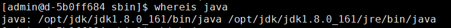
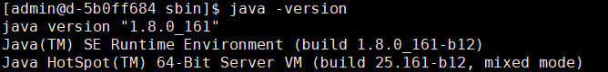
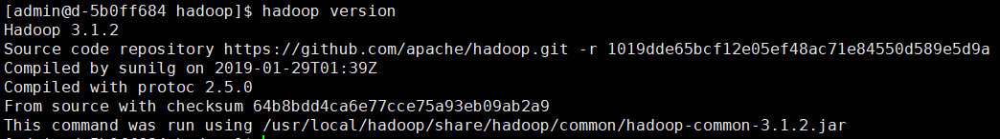
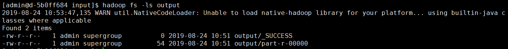
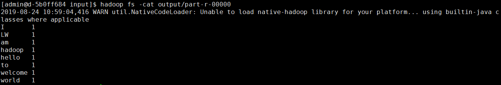
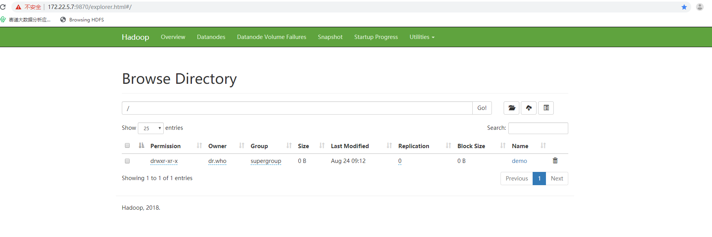
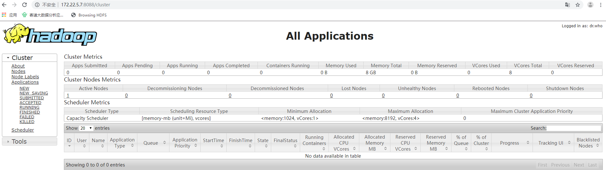
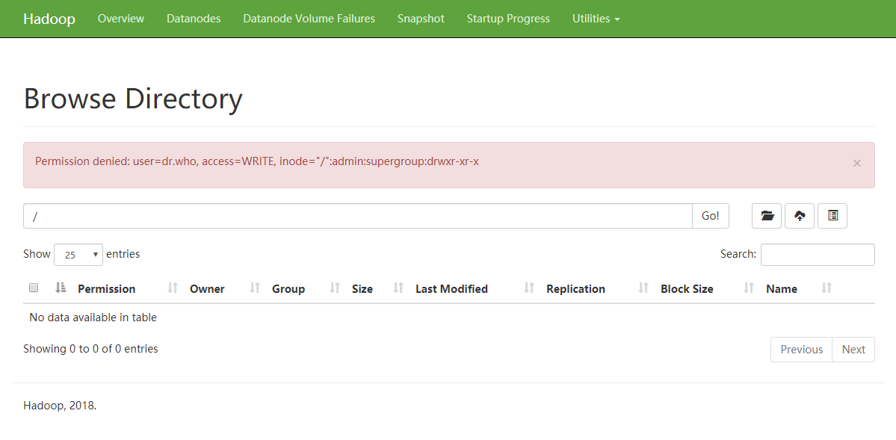
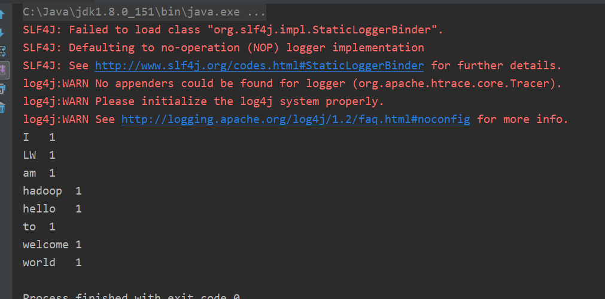

### 
linux环境搭建单机版hadoop

---

#### 一、JDK环境

- 查找java安装目录

      whereis java 
      
  

- 配置java环境变量

      sudo vim ~/.bash_profile
      
      export JAVA_HOME=/opt/jdk/jdk1.8.0_161
      export PATH=$JAVA_HOME/bin:$PATH
      export CLASSPATH=.:$JAVA_HOME/lib/dt.jar:$JAVA_HOME/lib/tools.jar
      
      source ~/.bash_profile
      
- 检查java是否安装成功

       java -version     

  
      
#### 二、hadoop环境

- hadoop 下载
  
     
     wget http://mirror.bit.edu.cn/apache/hadoop/common/hadoop-3.1.2/hadoop-3.1.2.tar.gz  
     
     

- hadoop 环境变量配置
    
      tar -zxvf hadoop-3.1.2.tar.gz   #解压
      cp -r hadoop-3.1.2  /usr/local/hadoop
      
      sudo vim /etc/profile
      
      export HADOOP_HOME=/usr/local/hadoop
      export HADOOP_INSTALL=$HADOOP_HOME
      export HADOOP_MAPRED_HOME=$HADOOP_HOME
      export HADOOP_COMMON_HOME=$HADOOP_HOME
      export HADOOP_HDFS_HOME=$HADOOP_HOME
      export YARN_HOME=$HADOOP_HOME
      export HADOOP_COMMON_LIB_NATIVE_DIR=$HADOOP_HOME/lib/native
      export PATH=$PATH:$HADOOP_HOME/sbin:$HADOOP_HOME/bin

      source /etc/profile
      
- 检查hadoop环境变量是否生效
      
      hadoop version
      
   
   
#### 三、WordCount

- 创建文件test.txt

      vim test.txt
    
      hello world I am hadoop
      welcome to LW
      
- 准备文件

        hdfs dfs -mkdir -p /user/admin/input #新建input文件夹
        hdfs dfs -put test.txt input         #将test.txt 拷贝到input
        
        
        
      
      
- 执行WordCount
    
      hadoop jar /usr/local/hadoop/share/hadoop/mapreduce/sources/hadoop-mapreduce-examples-3.1.2-sources.jar org.apache.hadoop.examples.WordCount input/test.txt output
      hadoop fs -ls output                 #查看输出文件
        
       
    
      hadoop fs -cat output/part-r-00000 查看文件的内容
      
      
    
    
      
#### 四、hadoop文件配置 

- core-site.xml
        
        sudo vim core-site.xml #配置内容如下：

        <configuration>
            <property>
                <name>fs.defaultFS</name>
                <value>hdfs://0.0.0.0:9000</value>
                <description>指定主节点（namenode）的通信地址</description>
            </property>
            <property>
                <name>hadoop.tmp.dir</name>
                <value>/usr/local/hadoop/temp</value>
                <description>指定hadoop运行时产生文件的存储路径</description>
            </property>
        </configuration>

- hdfs-site.xml

      sudo vim hdfs-site.xml #配置内容如下：
      
      <configuration>
         <property>
            <name>dfs.replication</name>
            <value>1</value>
            <description>分片数量，伪分布式将其配置成1即可</description>
         </property>
         <property>
            <name>dfs.permissions</name>
            <value>false</value>
            <description>客户端创建文件夹或者文件权限限制，false表示无限制</description>
         </property>
      </configuration>
      
#### 五、启动hadoop  
    
    cd /usr/local/hadoop/sbin
    ./start-all.sh
    
#### 六、浏览器hdfs文件系统
    
   地址：http://172.22.5.7:9870/explorer.html#/
   
   

#### 七、查看集群管理
   地址：http://172.22.5.7:8088/cluster 
   
   
              
            
            
#### 八、问题解决

- Permission denied: user=dr.who, access=WRITE, inode="/":admin:supergroup:drwxr-xr-x

- 解决：找到 hdfs-core.xml 文件, 将dfs.permissions 的配置项的value值改为 false

#### 九、hdfs 接口测试
    
    
    public class HadoopDemo {
    
        //hadoop文件系统的端口为9000
        private static final String PATH = "hdfs://172.22.5.7:9000/user/admin/output/part-r-00000";
    
        public static void main(String[] args) {
            InputStream in = null;
            try {
                URL.setURLStreamHandlerFactory(new FsUrlStreamHandlerFactory());
                in = new URL(PATH).openStream();
    
                //读取文件
                BufferedReader reader = new BufferedReader(new InputStreamReader(in));
                String line = null;
                while ((line = reader.readLine()) != null) {
                    System.out.println(line.toString());
                }
            } catch (IOException e) {
                e.printStackTrace();
            } finally {
                org.apache.hadoop.io.IOUtils.closeStream(in);
            }
        }
    }
    
    
   
    

