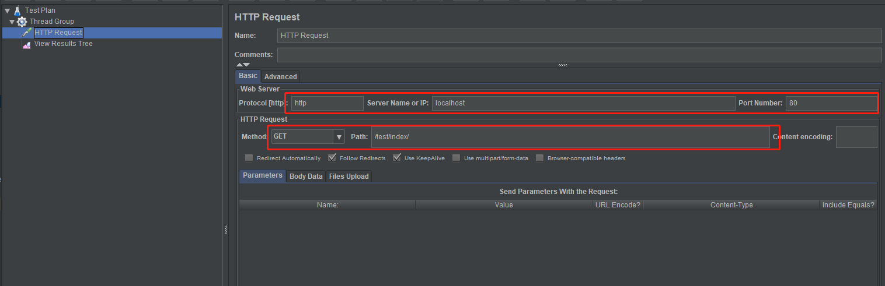

### 
nginx+sprig-boot+redis+jmeter 分布式锁实现以及测试

---

#### 一、nginx配置

- nginx安装(略过)
- nginx 负载均衡配置

  

      
#### 二、redis

- redis安装（略过）

- Redis DeskTop Manager 链接数据库（略过）

- 首先放入key:key1  value:100

  
     
   
#### 三、spring-boot 减库存应用

- 代码

      /**
       * super rui
       *
       * @return
       */  
      @RestController
      @RequestMapping("test/")
      public class Controller {
          private Logger logger = LoggerFactory.getLogger(Controller.class);
      
          @Autowired
          StringRedisTemplate stringRedisTemplate;
      
          @RequestMapping(value = "index/", method = RequestMethod.GET)
          public Object index() {
      
              String lockKey = "key_001";
              String valueKey = "key1";
              //Jedis jedis = new Jedis("localhost");
              try {
                  Boolean b = stringRedisTemplate.opsForValue().setIfAbsent(lockKey, "zhangrui");
                  if (!b) {
                      logger.error("error");
                      return "error";
                  }
                  int num = Integer.parseInt(stringRedisTemplate.opsForValue().get(valueKey));
                  if (num > 0) {
                      int nowNum = num - 1;
                      stringRedisTemplate.opsForValue().set(valueKey, nowNum + "");
                      logger.info("减库存成功，剩余库存：{}", nowNum);
                  } else {
                      logger.info("减库存失败！！");
                  }
              } finally {
                  stringRedisTemplate.delete(lockKey);
              }
              return "end";
          }
      
      }
      
      
       /**
       * 翟旭  刚哥
       *
       * @return
       */
      @RequestMapping("index/")
      public Object jedisTest() {
          Jedis jedis = new Jedis("localhost");
          Long value = jedis.decr("key1");
          logger.info("剩余库存：{}", value);
          if (value < 0) {
              jedis.incr("key1");
              logger.info("减库存失败");
          }
          return "end";
      }
      
      
      
      
#### 四、jmeter压力测试 

- 线程数设置

    

- http请求设置

    
- 测试结果

        : 减库存成功，剩余库存：99                : 减库存成功，剩余库存：98
        : error                                   : 减库存成功，剩余库存：97
        : 减库存成功，剩余库存：96                : 减库存成功，剩余库存：95
        : 减库存成功，剩余库存：94                : 减库存成功，剩余库存：93
        : error                                   : 减库存成功，剩余库存：92
        : 减库存成功，剩余库存：91                : 减库存成功，剩余库存：90
        : 减库存成功，剩余库存：89                : 减库存成功，剩余库存：88
        : 减库存成功，剩余库存：87                : 减库存成功，剩余库存：86
        : 减库存成功，剩余库存：85                : 减库存成功，剩余库存：84
        : error                                   : 减库存成功，剩余库存：83
        : 减库存成功，剩余库存：82                : 减库存成功，剩余库存：81
        : error                                   : 减库存成功，剩余库存：80
        : 减库存成功，剩余库存：79                : 减库存成功，剩余库存：78
        : error                                   : 减库存成功，剩余库存：77
        : 减库存成功，剩余库存：76                : 减库存成功，剩余库存：75
        : 减库存成功，剩余库存：74                : 减库存成功，剩余库存：73
        : 减库存成功，剩余库存：72                : 减库存成功，剩余库存：71
        : 减库存成功，剩余库存：70                : 减库存成功，剩余库存：69
        : error                                   : 减库存成功，剩余库存：68
        : 减库存成功，剩余库存：67                : 减库存成功，剩余库存：66
        : 减库存成功，剩余库存：65                : 减库存成功，剩余库存：64
        : 减库存成功，剩余库存：63                : 减库存成功，剩余库存：62
        : 减库存成功，剩余库存：61                : 减库存成功，剩余库存：60
        : error                                   : 减库存成功，剩余库存：59
        : 减库存成功，剩余库存：58                : 减库存成功，剩余库存：57
        : 减库存成功，剩余库存：56                : 减库存成功，剩余库存：55
        : 减库存成功，剩余库存：54                : 减库存成功，剩余库存：53
        : 减库存成功，剩余库存：52                : 减库存成功，剩余库存：51
        : 减库存成功，剩余库存：50                : 减库存成功，剩余库存：49
        : 减库存成功，剩余库存：48                : 减库存成功，剩余库存：47
        : 减库存成功，剩余库存：46                : 减库存成功，剩余库存：45
        : error                                   : 减库存成功，剩余库存：44
        : 减库存成功，剩余库存：43                : 减库存成功，剩余库存：42
        : 减库存成功，剩余库存：41                : 减库存成功，剩余库存：40
        : 减库存成功，剩余库存：39                : error
        : 减库存成功，剩余库存：38                : 减库存成功，剩余库存：37
        : 减库存成功，剩余库存：36                : 减库存成功，剩余库存：35
        : error                                   : 减库存成功，剩余库存：34
        : 减库存成功，剩余库存：33                : 减库存成功，剩余库存：32
        : 减库存成功，剩余库存：31                : 减库存成功，剩余库存：30
        : error                                   : 减库存成功，剩余库存：29
        : 减库存成功，剩余库存：28                : 减库存成功，剩余库存：27
        : 减库存成功，剩余库存：26                : 减库存成功，剩余库存：25
        : 减库存成功，剩余库存：24                : 减库存成功，剩余库存：23
        : 减库存成功，剩余库存：22                : 减库存成功，剩余库存：21
        : 减库存成功，剩余库存：20                : 减库存成功，剩余库存：19
        : 减库存成功，剩余库存：18                : error
        : 减库存成功，剩余库存：17                : 减库存成功，剩余库存：16
        : 减库存成功，剩余库存：15                : 减库存成功，剩余库存：14
        : 减库存成功，剩余库存：13                : 减库存成功，剩余库存：12
        : 减库存成功，剩余库存：11                : 减库存成功，剩余库存：10
        : error                                   : 减库存成功，剩余库存：9
        : 减库存成功，剩余库存：8                 : 减库存成功，剩余库存：7
        : error                                   : 减库存成功，剩余库存：6
        : 减库存成功，剩余库存：5                 : 减库存成功，剩余库存：4
        : 减库存成功，剩余库存：3                 : 减库存成功，剩余库存：2
        : 减库存成功，剩余库存：1                 : 减库存成功，剩余库存：0  

#### 五、存在的问题

- 如果程序执行到一半挂掉，就会永远死锁

- 即使加上过期时间，存在当前线程没执行完毕，索就没了，如果时间太长，不合理

- 锁失效的问题

